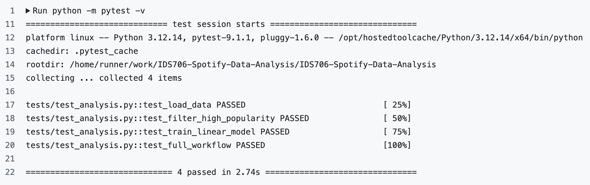

# Spotify Streaming Data Analysis

[](https://github.com/annemariehorn/IDS706-Spotify-Data-Analysis/actions/workflows/test.yml)

### *Slogan: "Refactor, Replay, Repeat!"*

## Project Goal

The goal of this project is to explore patterns in a synthetic Spotify streaming dataset using basic data analysis techniques in Python. The analysis focuses on track popularity and its relationship with characteristics such as genre, energy, and danceability.
                                                                                         
## Dataset

The dataset used in this project is the [**Spotify Artist Streaming Analytics 2020-2025**](https://www.kaggle.com/datasets/beamhonor0911/spotify-artist-streaming-analytics-20202025) dataset from Kaggle. It contains synthetic data for approximately 50,000 tracks from 2020-2025, including information about track characteristics, popularity, streaming performance, genre, and release information.

Because the dataset is synthetic, the results of this analysis are intended for educational purposes and do not represent actual Spotify streaming data.

## Setup Instructions

The analysis uses the following Python libraries:

- Pandas
- Polars
- Scikit-learn
- Matplotlib
- Pytest

Install the required Python packages using:

```bash
pip install -r requirements.txt
```

Run the analysis using:

```bash
python analysis.py
```

Run the tests using:

```bash
python -m pytest -v
```

## Data Inspection

The dataset was loaded and inspected using Pandas. `head()` was used to display the first few rows of the dataset, `info()` was used to examine the columns, data types, and non-null values, and `describe()` was used to calculate summary statistics for numerical variables.

The dataset was also checked for missing values and duplicate rows.

## Filtering and Grouping

Several filters were applied to explore different subsets of the data:

- Tracks with a high popularity category
- Tracks with an energy value greater than or equal to 0.8
- Pop tracks with a high popularity category

The tracks were also grouped by genre. The mean popularity and number of tracks were calculated for each genre and sorted by average popularity.

## Machine Learning Exploration

Linear regression was used to explore the relationship between track characteristics and popularity.

The first model used **energy as the input** and **popularity as the output**. The model produced an intercept of approximately 28.07 and an energy coefficient of approximately 0.109.

The second model used **danceability as the input** and **popularity as the output**. The model produced an intercept of approximately 28.07 and a danceability coefficient of approximately 0.108.

Both models produced small coefficients, suggesting that neither energy nor danceability alone has a strong linear relationship with track popularity in this dataset.

## Visualization

A scatter plot was created to visualize the relationship between energy and track popularity. Energy was plotted on the x-axis and popularity on the y-axis.

The plot shows that popularity varies widely across different energy levels and does not display a clear linear trend. This is consistent with the small energy coefficient produced by the linear regression model.

## Findings

The analysis showed that tracks vary considerably in popularity across different genres and audio characteristics. Grouping the data by genre allowed average popularity to be compared across genres.

The linear regression experiments found little linear relationship between popularity and either energy or danceability when each feature was considered individually. The scatter plot between energy and popularity also showed no clear linear trend, supporting the result of the energy regression model.

## Optional: Polars Exploration

In addition to Pandas, Polars was used to load and inspect the same Spotify dataset.

The dataset was loaded using `pl.read_csv()` and the first several rows were inspected using `head()`. The data was then filtered to identify tracks with a high popularity category.

The data was also grouped by genre using Polars, and the mean popularity was calculated for each genre and sorted from highest to lowest.

## Testing

Pytest is used to test the core functionality of the analysis.

The unit tests check:

- Data loading
- High popularity filtering
- Linear regression model training and prediction

A system/integration test checks that the full workflow runs successfully, including data loading, grouping, model training, and prediction.

Run all tests using:

```bash
python -m pytest -v
```

### Test Results

All tests pass successfully.



## Continuous Integration

GitHub Actions automatically runs the tests whenever changes are pushed to the repository or a pull request is created. The workflow uses Python 3.12, installs the required dependencies, and runs the pytest test suite.