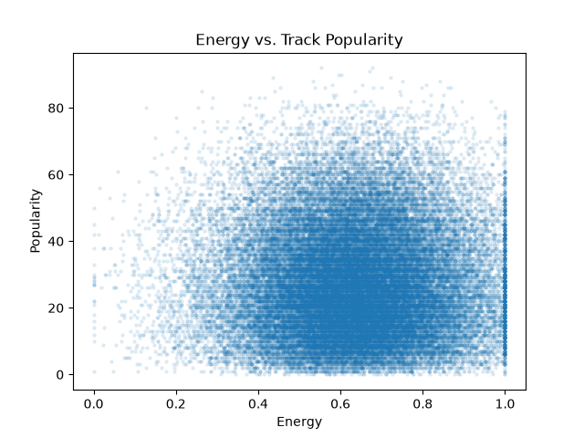
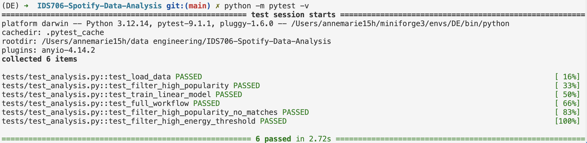
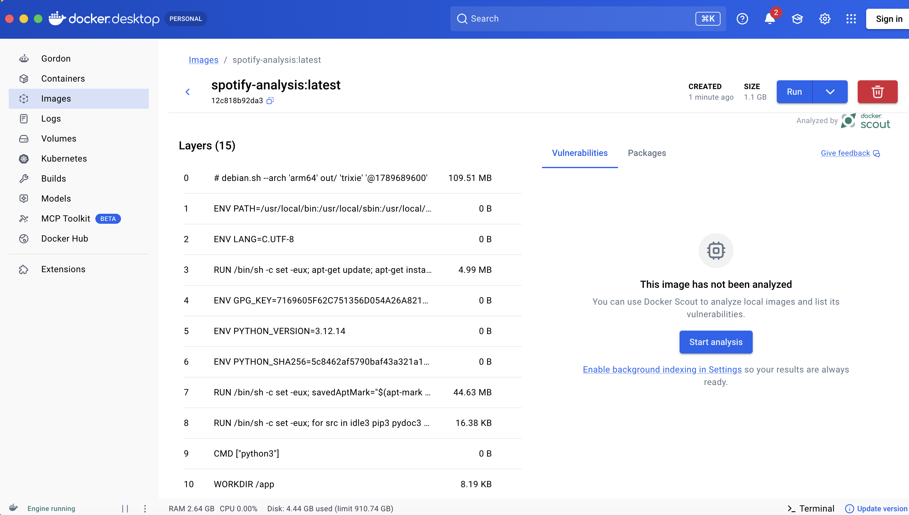
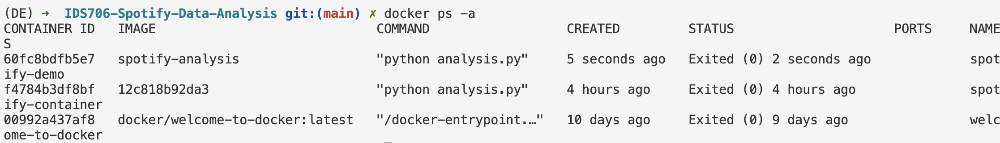
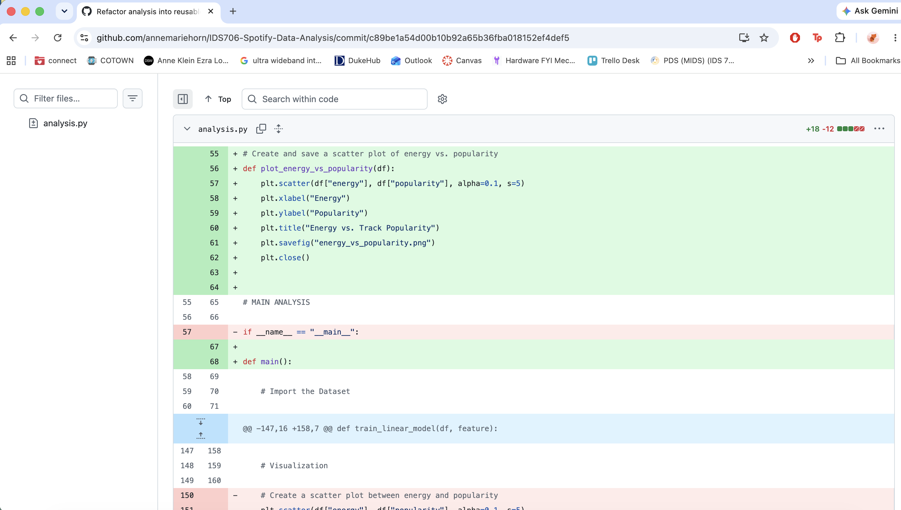

# Spotify Streaming Data Analysis

[](https://github.com/annemariehorn/IDS706-Spotify-Data-Analysis/actions/workflows/test.yml)

### *Slogan: "Refactor, Replay, Repeat!"*

## Project Goal

The goal of this project is to explore which track characteristics may be associated with popularity in a synthetic Spotify streaming dataset. The analysis examines whether characteristics such as genre, energy, and danceability help explain differences in track popularity.

## Dataset

The dataset used in this project is the [**Spotify Artist Streaming Analytics 2020-2025**](https://www.kaggle.com/datasets/beamhonor0911/spotify-artist-streaming-analytics-20202025) dataset from Kaggle. It contains synthetic data for approximately 50,000 tracks from 2020-2025, including information about track characteristics, popularity, streaming performance, genre, and release information.

Because the dataset is synthetic, the results of this analysis are intended for educational purposes and do not represent actual Spotify streaming data.

## Setup Instructions

The project uses the following Python libraries and development tools:

- Pandas
- Polars
- Scikit-learn
- Matplotlib
- Pytest
- Black
- Ruff

Install the required Python packages using:

```bash
pip install -r requirements.txt
```

Run the analysis using:

```bash
python analysis.py
```

Run the tests using:

```bash
python -m pytest -v
```

## Data Inspection and Quality

The dataset was loaded and inspected using Pandas. `head()` was used to display the first few rows, `info()` was used to examine the columns, data types, and non-null values, and `describe()` was used to calculate summary statistics for numerical variables.

The dataset was also checked for missing values and duplicate rows. The ranges of key numerical variables were inspected for potential outliers. Energy and danceability ranged from 0 to 1, while popularity ranged from 0 to 92. These values were within the expected ranges for the variables, so no observations were removed as outliers.

## Filtering and Grouping

Several filters were applied to explore different subsets of the data:

- Tracks with a high popularity category
- Tracks with an energy value greater than or equal to 0.8
- Pop tracks with a high popularity category

The tracks were also grouped by genre. The mean popularity and number of tracks were calculated for each genre and sorted by average popularity.

Punk had the highest average popularity in the dataset at approximately 28.76.

An additional comparison examined the average popularity of high-energy and lower-energy tracks. High-energy tracks (energy ≥ 0.8) had an average popularity of 27.94, while lower-energy tracks had an average popularity of 28.17.

## Machine Learning Exploration

Linear regression was used to explore the relationship between track characteristics and popularity.

The first model used **energy as the input** and **popularity as the output**. The model produced an intercept of approximately 28.07 and an energy coefficient of approximately 0.109.

The second model used **danceability as the input** and **popularity as the output**. The model produced an intercept of approximately 28.07 and a danceability coefficient of approximately 0.108.

Both models produced small coefficients, suggesting that neither energy nor danceability alone has a strong linear relationship with track popularity in this dataset.

## Visualization

A scatter plot was created to visualize the relationship between energy and track popularity. Energy was plotted on the x-axis and popularity on the y-axis.



The plot shows that popularity varies widely across different energy levels and does not display a clear linear trend. This is consistent with the small energy coefficient produced by the linear regression model.

## Findings

The analysis produced several key findings:

- Punk had the highest average popularity among the genres at approximately 28.76.
- High-energy tracks had an average popularity of 27.94 compared with 28.17 for lower-energy tracks.
- Energy alone showed little linear relationship with popularity.
- Danceability alone also showed little linear relationship with popularity.
- The energy-versus-popularity scatter plot did not show a clear linear trend.

Overall, the results suggest that energy and danceability individually do not explain much of the variation in popularity in this synthetic dataset.

## Optional: Polars Exploration

In addition to Pandas, Polars was used to load and inspect the same Spotify dataset.

The dataset was loaded using `pl.read_csv()` and the first several rows were inspected using `head()`. The data was then filtered to identify tracks with a high popularity category.

The data was also grouped by genre using Polars, and the mean popularity was calculated for each genre and sorted from highest to lowest.

## Testing

Pytest is used to test the core functionality of the analysis.

The tests include:

- Data loading
- High-popularity filtering
- Linear regression model training and prediction
- A full analysis workflow test
- An edge case where no tracks match the high-popularity filter
- An edge case at the exact high-energy threshold of 0.8

Run all tests using:

```bash
python -m pytest -v
```

### Test Results

All six tests pass successfully.



## Code Quality

Black is used to maintain consistent Python formatting, and Ruff is used for linting.

Run the formatting and linting checks using:

```bash
black --check .
ruff check .
```

Both checks are also included in the GitHub Actions workflow.

## Continuous Integration

GitHub Actions automatically runs whenever changes are pushed to the repository or a pull request is created. The workflow uses Python 3.12, installs the required dependencies, checks formatting with Black, checks code quality with Ruff, and runs the Pytest test suite.

The CI status badge at the top of this README shows the current workflow status.

## Docker

The project can also be run inside a Docker container to provide a consistent and reproducible environment.

Build the Docker image:

```bash
docker build -t spotify-analysis .
```

Run the container:

```bash
docker run --rm spotify-analysis
```

The Docker image contains the project code and required Python dependencies. This allows the analysis to run in an isolated environment without relying on the local Python environment.

### Docker Results

Successful Docker image build:



Successful container run:



## Refactoring

The project was refactored to improve the organization and readability of `analysis.py`. The main analysis workflow was moved into a `main()` function, and the visualization logic was extracted into a separate `plot_energy_vs_popularity()` function.

These changes separate reusable functionality from the main execution workflow and make the structure of the analysis easier to follow.

After refactoring, the project was verified by running Black, Ruff, and the full Pytest suite. All formatting and linting checks passed, and all tests continued to pass.

### Refactoring Example

The following GitHub commit diff shows the extraction of the main workflow and visualization function:

